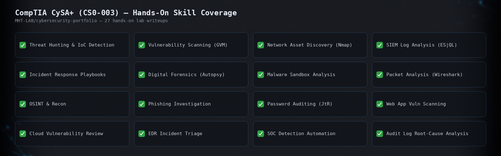

# Dustin Ramsey: Security Operations Lab Notes

Hands-on writeups from CompTIA CySA+ (CS0-003) lab work completed as part of WGU's
D483 Security Operations course, plus related SOC and detection-engineering
practice (LimaCharlie, Huntress, Sigma, threat hunting).

I write these up as I go. The goal is to show how I actually work through a
detection, hunting, or incident-response scenario, not just that I completed a
checklist item.

## Why this exists

I run Mars Hill Technology (an MSP) and I'm finishing a cybersecurity master's
degree at WGU, with CompTIA Security+ and CySA+ along the way. This repo is
where the hands-on side of that lives: what I actually did, the tools I used,
what I found, and what I'd do differently. It's aimed at SOC analyst,
detection engineering, and MSP security roles.

## How to read this

Each file in [`labs/`](./labs) is one lab or practice session, written in my
own words: objective, approach, tools, findings, and takeaway. None of these
reproduce CompTIA's, WGU's, or any vendor's proprietary lab instructions,
screenshots of question text, or answer keys. See [Guardrails](#guardrails)
below.

[`huntress-trial/`](./huntress-trial) is a separate working log from a live
trial of the Huntress Managed Security Platform (EDR, ITDR, SIEM, ISPM,
SAT), hands-on work inside the actual product instead of a training lab.

## Index

_(updated as labs are added, newest first)_

<!-- LAB-INDEX-START -->
- [Windows Privilege Escalation & IoC Hunt](https://github.com/MHT-LAB/cybersecurity-portfolio/blob/master/labs/2026-09-18-windows-privesc-uac-bypass-ioc-hunt.md): Performed a UAC-bypass privilege escalation on a Windows target via Metasploit, then switched roles to trace the full attack chain — initial access, escalation, and anti-forensics attempts — through Windows Security event logs.
- [Directory Traversal & Command Injection: Exploitation and Log-Based Investigation](https://github.com/MHT-LAB/cybersecurity-portfolio/blob/master/labs/2026-09-18-traversal-and-command-injection.md): Exploited directory traversal and command injection on DVWA, then investigated both attacks through Apache access.log and error.log, correlating exploitation techniques to their log-based IoCs.
- [Password Cracking: John the Ripper (Dictionary/Brute Force) and Wireless PSK Cracking](https://github.com/MHT-LAB/cybersecurity-portfolio/blob/master/labs/2026-09-15-password-cracking-jtr.md): Compared dictionary and brute-force password attacks with John the Ripper, then cracked WPA/WPA2 wireless passwords with aircrack-ng.
- [Analyzing Cloud Vulnerabilities: Auditing AWS Environments with ScoutSuite and Prowler](https://github.com/MHT-LAB/cybersecurity-portfolio/blob/master/labs/2026-09-15-cloud-vuln-scan-review.md): Audited an AWS environment against a security policy using ScoutSuite, then reviewed a Prowler report from an acquisition target for M&A due diligence.
- [Web Vulnerability Scanning Across CLI, TLS, Online, and Automated Recon Tools](https://github.com/MHT-LAB/cybersecurity-portfolio/blob/master/labs/2026-09-14-nikto-wapiti-web-vuln-scan.md): Compared Nikto, Wapiti, Nmap NSE, SSL Labs, Pentest Tools, and Legion across application, server, TLS, and automated-recon scanning — including a deprecated-TLS policy violation and an exposed Docker Registry API.
- [MS10 Server Assessment: Nmap Vulnerability Scanning and Adversary-in-the-Middle Credential Theft](https://github.com/MHT-LAB/cybersecurity-portfolio/blob/master/labs/2026-09-14-ms10-vuln-scan-aitm-credential-theft.md): Scanned a Windows Server 2016 host with nmap's NSE vuln scripts, then executed a social-engineering-driven AitM attack to intercept a victim's plaintext web login credentials via Burp Suite.
- [Malware Triage with Sandbox Analysis and Hash Reputation Lookup](https://github.com/MHT-LAB/cybersecurity-portfolio/blob/master/labs/2026-09-13-malware-sandbox-and-hash-reputation-lookup.md): Explored Joe Sandbox Cloud's malware detonation reports (Zeus, Mirai) and used SHA1 hash lookups against MetaDefender Cloud to triage a suspicious file without uploading or executing it.
- [File Analysis Fundamentals: Strings, Hash Verification, and Hex Editing](https://github.com/MHT-LAB/cybersecurity-portfolio/blob/master/labs/2026-09-13-file-analysis-strings-hashing-hexedit.md): Used `strings`, `md5sum`, and `hexeditor` on a Kali VM to triage unknown files, verify a forensic test image's integrity, and locate known keywords inside a raw disk image.
- [OSINT Domain & IP Reconnaissance](https://github.com/MHT-LAB/cybersecurity-portfolio/blob/master/labs/2026-09-10-osint-domain-ip-recon.md): traced a suspicious domain and email-header IP through WHOIS, ARIN, AbuseIPDB, and authoritative DNS enumeration with nslookup and dig.
- [Sniffing Cleartext Credentials with tcpdump and Wireshark](https://github.com/MHT-LAB/cybersecurity-portfolio/blob/master/labs/2026-09-10-tcpdump-wireshark-cleartext-credential-capture.md): capturing HTTP and FTP traffic with tcpdump, then reassembling streams in Wireshark to pull a plaintext login payload and a full certificate file back out of the pcap, showing exactly why cleartext protocols expose credentials and data.
- [Detecting IoCs in Wazuh: Brute Force, Log Tampering, and Privilege Escalation](https://github.com/MHT-LAB/cybersecurity-portfolio/blob/master/labs/2026-09-10-wazuh-ioc-detection-brute-force-anti-forensics.md): simulating an RDP brute force, event log clearing, and post-compromise account tampering, then evaluating how Wazuh's default rules detect (and sometimes mislabel) each one.
- [Tracing a Disabled Audit Policy Back to a Phishing-Enabled Credential Theft](./labs/2026-09-05-audit-policy-tampering-root-cause-investigation.md): a multi-host root cause investigation starting from a Wazuh audit-policy-change alert, tracing an RDP session on a domain controller back through a hijacked proxy, a phishing email, firewall logs, and a packet capture to find exactly how an attacker stole a domain admin's credentials.
- [Manually Executing an Incident Response Playbook for a High-CPU Rogue Process](./labs/2026-09-03-manual-incident-response-playbook-high-cpu.md): responding by hand to a SIEM-detected CPU spike after a SOAR outage, using CLI tools for every step from identifying and killing the rogue process through hashing, VirusTotal lookup, ownership check, quarantine transfer, and secure cleanup.
- [Recovering Hidden JPEG Evidence with Autopsy](./labs/2026-09-01-autopsy-hidden-jpeg-recovery.md): acquiring and hash-verifying a drive image, then using Autopsy to locate and recover five hidden JPEGs disguised through a renamed extension, deletion, deletion plus a renamed extension, and burial inside a zip archive, confirming each by its real file signature instead of its name.
- [File Carving a Corrupted FAT Image by Rebuilding the Boot Sector](./labs/2026-09-01-file-carving-boot-sector-repair.md): recovering a corrupted FAT drive image by rebuilding its boot sector in testdisk after every metadata-based tool (fdisk, fiwalk, fsstat, mmls) failed, then copying out all 15 files it made accessible again.
- [Recovering Deleted Files from an NTFS Image with tsk_recover](./labs/2026-09-01-ntfs-deleted-file-recovery.md): using tsk_recover to automatically pull deleted files, including a full deleted folder structure, from an NTFS drive image straight from its Master File Table.
- [Finding a Hidden Partition on a Damaged MBR Disk Image](./labs/2026-09-01-hidden-partition-discovery.md): comparing fdisk, testdisk, and mmls output to find a logical drive stripped from an MBR partition table, then mounting the hidden partition directly to confirm what it held.
- [Identifying Legacy Systems with nmap, Metasploit, and EOL Research](./labs/2026-08-31-legacy-system-identification-nmap-metasploit.md): fingerprinting OS versions across a server network with nmap, refining fuzzy results with Metasploit's smb_version module, then checking each version against its real end-of-support date to find which systems are already legacy.
- [Building Context Awareness on a Suspicious Email Through Header and OSINT Analysis](./labs/2026-08-28-email-header-analysis-phishing-investigation.md): chaining CentralOps, That'sThem, Have I Been Pwned, MXToolbox, WHOIS, ARIN, and IP2Location to investigate a spoofed Microsoft Defender phishing email, and why no single result in the chain is conclusive on its own.
- [Context-Aware Vulnerability Prioritization: Matching CVEs to Network Documentation](./labs/2026-08-28-cve-network-context-prioritization.md): researching CVEs against an internal server segment, an external screened subnet, and an isolated legacy system, then cross-referencing network documentation and compensating controls (OS, segment, internet access direction, application allowlisting) to set real mitigation priority instead of ranking on CVSS score alone.
- [Passive Vulnerability Scanning and OS Fingerprinting with Wireshark](./labs/2026-08-28-passive-scanning-wireshark.md): generating and reading ICMP and SSH traffic on a switched lab network to fingerprint OS type, spot ICMP filtering, and compare plaintext vs. encrypted traffic.
- [Standing Up Credentialed and Uncredentialed Scans in Greenbone Security Assistant](./labs/2026-08-27-gsa-vulnerability-scan-setup.md): launching GSA/GVM, configuring both an uncredentialed and a credentialed scan target and task against a Windows Server 2016 system, then reviewing both completed reports and tracing one finding out through its CVE record and CVSS score.
- [Network Asset Discovery and Identification with nmap](./labs/2026-08-27-nmap-asset-discovery.md): ping sweeps, a combined SYN port scan, version scan, and OS detection scan across three subnets, comparing output formats along the way.
- [Setting Linux File Permissions with chmod](./labs/2026-08-27-linux-file-permissions.md): practicing symbolic and octal chmod notation on Kali, then locking down demofile.sh to owner-full, group-execute, no access for others.
- [Hardening a System by Blocking ICMP with Firewall Rules](./labs/2026-08-27-icmp-firewall-hardening.md): testing ICMP with ping between two Windows systems, then blocking Echo Request rules in Windows Defender Firewall with Advanced Security and re-testing.
- [Removing Unneeded Applications and Services](./labs/2026-08-27-remove-apps-services.md): uninstalling an unused app and removing the FTP role service on Windows Server through the Remove Roles and Features Wizard.
- [Controlling Name Resolution with the Hosts File](./labs/2026-08-27-hosts-file-name-resolution.md): editing /etc/hosts on Kali to force, block, and redirect resolution of a domain, and testing each state with wget.
- [Removing Unneeded Device Drivers to Harden a Windows System](./labs/2026-08-27-device-driver-management.md): using Windows Device Manager to scan for hardware changes, update a driver, disable/enable a device, and uninstall a device to see when a removal actually sticks.
- [Threat-Feed-Driven Security Automation: Firewall Blocking, Malware Removal, and DNS Sinkholing](./labs/2026-08-26-threat-feed-firewall-automation.md): a three-part lab covering bash, iptables, and cron IP blocking (with a duplicate-rule bug found and fixed mid-lab), SHA-256-verified automated malware removal, and DNS sinkholing via /etc/hosts.
<!-- LAB-INDEX-END -->

## Guardrails

- **No copyrighted vendor content.** CompTIA lab instructions, question text,
  and CertMaster material stay out. Every writeup describes methodology and
  findings in my own words: what the scenario was in plain terms, what I did,
  what I saw, what it means.
- **No client data.** Nothing from Mars Hill Technology client environments.
  No client names, IPs, hostnames, configs, or credentials.
- **No live exploits or unpatched disclosures.**

## Stack / current focus

Currently: CompTIA CySA+ (CS0-003) hands-on labs via WGU D483, LimaCharlie EDR,
Huntress, Sigma detection rules, and Security+ (SY0-701).

## Contact

Dustin Ramsey | [LinkedIn](www.linkedin.com/in/dustin-ramsey-805494392) | Mars Hill Technology
