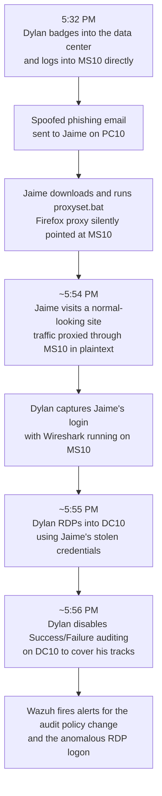

# Tracing a Disabled Audit Policy Back to a Phishing-Enabled Credential Theft

**Domain:** Incident Response and Management (CySA+ CS0-003)
**Tools used:** Wazuh, Windows Event Viewer, auditpol, Command Prompt, Mozilla Thunderbird, Firefox, Wireshark, OPNsense firewall live logs, badge access and video records
**Type:** CompTIA hands-on lab (WGU D483 Security Operations)

## Scenario

I got a security flash message saying several audit policies had been changed on a domain controller called DC10. Disabling audit logging is a classic move once an attacker has enough access to start covering their tracks, so this was a root cause investigation from the start. My job was to work backward from that one alert, confirm it was real, find out who made the change, and figure out how they got the access to do it. That last part ended up taking me across five different systems.

## Approach

### Triaging the Wazuh alert

I started in Wazuh and pulled up Security Events, filtered to the day of the incident, and searched for the rule ID named in the flash message. That rule fires on Windows audit policy change events. The alerts showed Success and Failure auditing being removed from several categories, and the account tied to every one of them was jaime, an account with administrator rights across the network. That combination (an admin account, disabling logging, right before something else likely happened) is exactly the kind of pattern that should stop a SOC analyst cold.

While I was in there, I also found a separate Wazuh alert for a logon event on the same account, right before the policy changes, flagged as a Remote Desktop connection. The source system for that RDP session was not Jaime's normal workstation. That mismatch is what sent me to DC10 directly.

### DC10: confirming the audit policy change

On DC10 I ran `auditpol /get /category:*` first, to see the current state of the audit policy. Most categories still showed Success and Failure configured, which told me the attacker had not wiped out the whole policy, just specific subcategories. That meant I needed the event log itself to see exactly what got turned off and when, since a snapshot of the current policy state doesn't show a change that already happened.

I opened Event Viewer, went to the Security log, and looked up the event record Wazuh had already pointed me to. It was Event ID 4719, which is the built-in Windows event for an audit policy change, and it was the last in a run of several identical events, all made within the same short window in the evening. That confirmed the alert: someone had gone through and turned off both Success and Failure auditing on more than one category, back to back, in one sitting.

Next I pulled up the RDP logon event Wazuh had flagged, using the record ID from the alert. The logon type on that record was 10, RemoteInteractive, which is the type Windows assigns specifically to Remote Desktop sessions. The source system was 10.1.16.2, an older Windows Server named MS10. Jaime's real workstation is PC10 at 10.1.24.101, and normal practice for the team is to manage domain controllers at the console, not over RDP. Two red flags in one event record.

Before going further, I checked Jaime's badge access and work schedule. He never entered the data center that day, and he'd already left for the evening by the time these events happened. MS10 sits in a different building's data center entirely. That ruled Jaime out physically, even though his account was doing all the work on paper.

### MS10: finding who was actually behind the keyboard

Since the RDP session originated from MS10, I moved there next. I searched the Security log around the timestamp from the DC10 RDP event and found a logon event, Event ID 4648, which logs an attempt to run something using explicit alternate credentials. The account name on that event was jaime, and the timestamp lined up almost to the second with the RDP connection landing on DC10. That confirmed MS10 was the real origin point and that whoever was sitting at MS10 had Jaime's credentials in hand.

The account actually logged into MS10 at the time, though, was dylan, someone in HR with a standard, non-admin account. I found the matching logon event, Event ID 4624, and the logon type on that one was 2, Interactive. That means a physical logon at the console, not a remote session. Data center entry logs and video backed that up: Dylan badged into the data center at 5:32 PM and was seen walking in on camera.

So at this point, the picture was: Dylan physically logged into MS10 himself, then used Jaime's credentials, which he should not have had, to RDP into DC10 and turn off auditing. The open question was how a standard HR account ended up holding a domain admin's login.

### PC10: finding the phishing email

I moved to Jaime's actual workstation next. The local event log and malware scanner didn't turn up anything, so I checked his email in Thunderbird. His inbox was basically empty except for one message with an oddly worded subject line, something like a free-juice giveaway. The grammar was off enough to be a giveaway on its own, and even though the sender address looked legitimate, that's trivial to spoof.

The email pushed two things: a "System Update" link and a link to an internal-sounding site called Juice Shop. Hovering over the System Update link showed a URL pointing to a raw IP address and a file called proxyset.bat. I confirmed the file existed on disk under Jaime's Downloads folder, which meant he'd clicked it and downloaded it.

Reading the contents of proxyset.bat in a Command Prompt showed it was built to change Firefox's network proxy settings. I checked Firefox's own connection settings and found Manual proxy configuration turned on, which meant the script had run, not just downloaded and sat there. Between the file on disk and the live proxy setting, that's a confirmed execution, not just a delivered payload.

That second link in the email, to the "legitimate" Juice Shop site, only made sense once I saw the proxy change. With Firefox now routing everything through an attacker-controlled proxy, visiting a normal-looking internal site was actually sending traffic somewhere it shouldn't go.

### ROUTER-BORDER: confirming where that traffic actually went

To find out if Jaime had actually clicked through to Juice Shop, I went to the company's border firewall, an OPNsense box named ROUTER-BORDER, sitting between the internal network and the internet. I resolved juiceshop.com to its IP address first, then opened the firewall's live log viewer and filtered on that destination.

Filtering for traffic sourced from Jaime's real workstation, PC10, turned up nothing, which ruled out a direct connection. Filtering for traffic sourced from MS10 instead turned up several matching sessions. That confirmed the proxy script had done its job: Jaime's browser traffic to Juice Shop was actually leaving the network from MS10, not from his own machine.

Opening the detail on one of those sessions showed the destination port used was the plain HTTP port, not HTTPS. That's the second half of the story: not only was the traffic being routed through an attacker's machine, it was unencrypted the whole way, meaning anything Jaime typed on that site, including a login, would have been readable to anyone watching that traffic. The timestamp on the firewall log, once converted from the firewall's UTC clock to the network's local time zone, landed right in the gap between the phishing script running and the RDP session hitting DC10, which lined the whole timeline up cleanly.

### Back to MS10: finding the actual stolen credentials

The last piece was proving how Dylan got Jaime's password in the first place. Back on MS10, the original proxyset.bat file itself was gone, but I found a related PowerShell script, proxy.ps1, sitting in a folder named C:\HR. That's not a coincidence given Dylan works in HR and would have normal access to that folder.

Searching the system for packet capture files turned up a file named juiceshop.pcapng, sitting inside Dylan's own Windows profile folder. Opening it in Wireshark and filtering for HTTP POST requests (POST is how a login form submits credentials, GET is just requesting a page) narrowed it down to the login request. Reading the raw bytes of that packet in the ASCII column showed Jaime's actual username and password, sent in the clear, straight from his own login attempt.

That closed the loop. Dylan logged into MS10 physically, ran a script that set himself up as an unauthorized proxy and packet sniffer, phished Jaime into routing traffic through that proxy, captured Jaime's login in plaintext, then used those stolen credentials to RDP into DC10 and disable the audit policy behind him.

## Findings

- Root cause: an HR employee (dylan) physically accessed a lightly monitored older server (MS10) and set it up as an unauthorized man-in-the-middle proxy.
- Initial access vector: a spoofed phishing email to a domain admin (jaime), delivering a script that silently changed the victim's browser proxy settings.
- Credential theft mechanism: the compromised proxy routed the victim's traffic to a normal-looking site over plaintext HTTP, and the attacker captured the login with Wireshark from the same server acting as the proxy.
- Privilege abuse: the stolen admin credentials were used over RDP, a method the victim did not normally use, from a system the victim did not normally use, to reach the domain controller.
- Anti-forensic action: once on the domain controller, the attacker disabled Success and Failure auditing on multiple categories, which is a direct attempt to blind future logging, confirmed by a run of matching Event ID 4719 records.
- Every step left a trail somewhere: SIEM alert, Windows Security event log on three separate hosts, firewall logs, badge and video records, and a packet capture the attacker left behind on his own machine.

## What I'd do differently / lessons learned

Cross-referencing physical access logs against account activity early made a real difference here. If I'd only trusted the account name in the logs, I'd have gone looking for Jaime, not Dylan. Pulling badge and video evidence as soon as the RDP source system looked wrong is something I'd do earlier next time, not after finishing the log analysis.

I also want to get faster at pivoting straight to the relevant Event ID instead of scrolling. Knowing that 4719 means audit policy change, 4648 means logon with explicit credentials, and 4624 means a straight logon, and building a small personal reference sheet of the Event IDs I keep running into, would save real time in a live investigation instead of a lab where the record numbers get handed to you.

The proxy angle is the part I'd study more. I understood what the script did once I read it, but recognizing a malicious proxy change as the reason a plaintext credential capture was even possible, before seeing the pcap, is the kind of pattern recognition that only comes from doing this more than once.

## Why this matters for the job

This is the same kind of investigation a Tier 2 or Tier 3 SOC analyst runs when a SIEM fires on a defense-evasion technique like disabled logging (this maps to MITRE ATT&CK T1562.002, Impair Defenses: Disable Windows Event Logging). The skill being tested isn't reading one alert, it's treating that alert as a starting point and following the evidence backward through multiple hosts, a firewall, and non-log sources like badge records, until the full chain from initial access to impact is documented well enough to hand to a CISO or write into an incident report.

## Attack timeline

